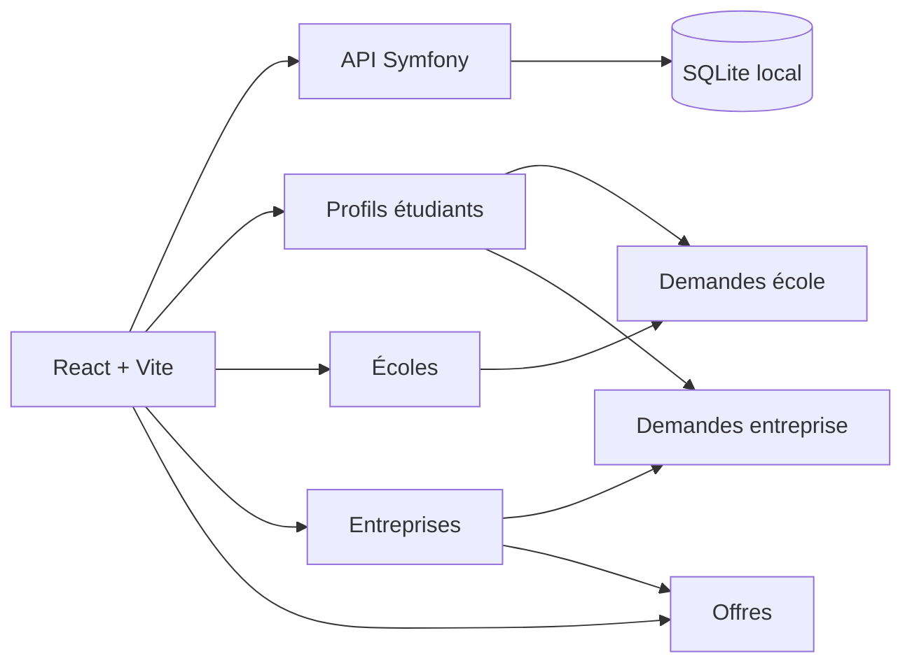

# GotT

GotT est une plateforme de mise en relation entre étudiants, écoles et entreprises. Le projet permet de gérer des profils publics, des annuaires, des offres, des demandes d'association validées par les écoles/entreprises, et une expérience de profil proche d'un mini LinkedIn.



## Fonctionnalités

- Annuaire des talents avec recherche, tags, fiches étudiants et liens vers école/entreprise.
- Pages publiques écoles et entreprises avec bio, spécialités, points forts, réseaux et multi-localisations.
- Profils connectés éditables selon le rôle: étudiant, école, entreprise ou admin.
- Workflow de validation: un étudiant demande à rejoindre une école ou une entreprise, puis l'organisation accepte ou refuse depuis sa page `Demandes`.
- Offres d'emploi liées aux entreprises, avec filtres et affichage détaillé.
- Dashboard admin pour valider les comptes, gérer les rôles et supprimer des utilisateurs.
- Résumés et matching intelligents côté front via les composants dédiés.
- Thème clair/sombre et interface Material UI.

## Stack

- Frontend: React, Vite, React Router, Material UI.
- Backend: Symfony, PHP, SQLite, JWT.
- Base locale: `Back/var/cvtheque.db`.
- Scripts de démarrage: `start-dev.sh` et `start-dev.ps1`.

## Démarrage rapide

Prérequis:

- PHP 8.1 ou plus récent recommandé
- Composer
- Node.js et npm
- SQLite, facultatif mais pratique pour inspecter la base

Installation:

```bash
cd Back
composer install --no-interaction

cd ../Front
npm install

cd ..
```

Démarrer le projet complet:

```bash
./start-dev.sh
```

Le script installe les dépendances manquantes, prépare la base SQLite, lance les migrations, puis démarre:

- Front: http://127.0.0.1:5173
- API: http://127.0.0.1:8000

Si le port `5173` est déjà pris, Vite peut proposer un autre port.

## Démarrage manuel

Backend:

```bash
cd Back
export DATABASE_URL="sqlite:///var/cvtheque.db"
php bin/console doctrine:migrations:migrate --no-interaction
php -S 127.0.0.1:8000 -t public public/index.php
```

Frontend:

```bash
cd Front
VITE_API_URL="http://127.0.0.1:8000" npm run dev -- --host 127.0.0.1 --port 5173
```

## Comptes utiles en dev

Admin local:

- Email: `admin@cvtheque.local`
- Mot de passe: `admin123`

École Hexagone:

- Email: `ecole-hexagone-versailles@cvtheque.local`
- Mot de passe: `hexagone123`

Les nouveaux comptes créés via l'inscription sont en attente tant qu'un admin ne les valide pas.

## Pages principales

- `/`: annuaire des talents
- `/schools`: annuaire des écoles
- `/schools/:id`: profil public d'une école
- `/school-requests`: demandes reçues par l'école connectée
- `/companies`: annuaire des entreprises
- `/companies/:id`: profil public d'une entreprise
- `/company-requests`: demandes reçues par l'entreprise connectée
- `/jobs`: offres d'emploi
- `/profile`: profil du compte connecté
- `/admin`: administration
- `/login`: connexion et inscription

## Workflow de validation

Un étudiant ne peut pas afficher librement une école ou une entreprise sur son profil public sans validation.

1. L'étudiant choisit une école ou une entreprise depuis sa page profil.
2. La demande est stockée dans son profil avec un statut `pending`.
3. L'école ou l'entreprise connectée voit la demande dans sa page `Demandes`.
4. En cas d'acceptation, le lien devient officiel et apparaît automatiquement sur le profil de l'étudiant.
5. En cas de refus, la demande est retirée ou marquée comme rejetée selon le endpoint appelé.

Champs utilisés côté profil:

- École: `pendingSchoolId`, `pendingSchoolStatus`, puis `schoolId` après validation.
- Entreprise: `pendingCompanyId`, `pendingCompanyStatus`, puis `companyId` après validation.

## Profils écoles et entreprises

Les écoles et entreprises sont des comptes à part entière. La page `/profile` édite donc le profil du compte connecté, sans choix manuel de profil public.

Les profils peuvent gérer:

- Nom de l'organisation
- Bio ou accroche
- Spécialités sous forme de tags
- Plusieurs localisations
- Réseaux ou site public selon les données disponibles
- Points forts pour les écoles, limités à 4 affichés côté public

Quand une information manque, l'interface affiche une valeur de repli comme `Non renseigné`.

## Données et API

L'API principale expose notamment:

- `POST /login`
- `POST /register`
- `GET /users`
- `PATCH /users/{id}`
- `PATCH /users/{id}/pending-company`
- `PATCH /users/{id}/pending-school`
- endpoints étudiants, écoles, entreprises, jobs et IA selon les contrôleurs Symfony

La source principale actuelle pour les comptes, profils et associations est la table `users`, avec des champs relationnels et un `profileJson` pour les données enrichies.

## Commandes utiles

Frontend:

```bash
cd Front
npm run dev
npm run build
npm run lint
```

Backend:

```bash
cd Back
php bin/console doctrine:migrations:migrate
php bin/console debug:router
```

Inspecter la base:

```bash
sqlite3 Back/var/cvtheque.db
```

## Structure

```text
Back/
  src/Controller/      API Symfony
  src/Entity/          entités Doctrine historiques
  migrations/          migrations SQLite
  var/cvtheque.db      base locale

Front/
  src/pages/           pages React
  src/components/      composants UI
  src/services/        appels API
  src/data/            profils enrichis et fallbacks front
```

## Notes de dev

- Le nom visible du projet est `GotT`; certains noms techniques historiques comme `cvtheque.db` ou `cv_token` peuvent encore exister.
- Les erreurs console de type extension navigateur peuvent apparaître selon le navigateur; les erreurs React ou API du projet sont celles à traiter en priorité.
- Après une modification de navigation ou de route, rechargez le front si Vite ne prend pas le hot reload correctement.
