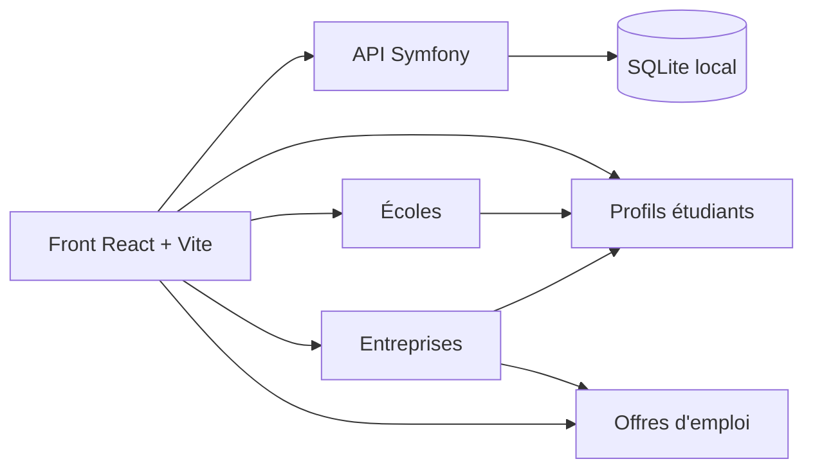

# GotT

Plateforme de mise en relation pour étudiants, écoles et entreprises, avec profils liés, recherche par tags et fiches éditables.



## Ce que fait le projet

- Annuaire des étudiants avec fiches détaillées et filtrage par compétence.
- Pages écoles et entreprises avec recherche, présentation enrichie et listes associées.
- Profil connecté éditable selon le rôle, avec tags partagés réutilisables dans toute l’application.
- Offres d’emploi liées aux entreprises et filtrables par mots-clés.
- Console admin locale pour valider les comptes et gérer les rôles.

## Démarrage rapide

Prérequis locaux:

- `php` (>=8.1 recommandé)
- `composer` (pour les dépendances PHP)
- `node` & `npm` (ou `pnpm`/`yarn`) pour le frontend
- `sqlite3` (facultatif pour inspection)

1) Depuis la racine du projet, installez les dépendances si nécessaire:

```bash
# PHP (Back)
cd Back && composer install --no-interaction

# Frontend (Front)
cd ../Front && npm install

# revenir à la racine
cd ..
```

2) Démarrer le projet complet (backend + frontend) :

```bash
./start-dev.sh
```

3) Ou démarrer séparément si vous préférez :

```bash
# Backend (dev server PHP intégré)
cd Back
# Assure la variable d'environnement pour utiliser la DB locale
export DATABASE_URL="sqlite:///var/cvtheque.db"
php -S 127.0.0.1:8000 -t public public/index.php

# Frontend (Vite)
cd ../Front
VITE_API_URL="http://127.0.0.1:8000" npm run dev -- --host 127.0.0.1 --port 5173
```

4) Points d'accès:

- Front: http://127.0.0.1:5173 (ou le port Vite affiché)
- API Symfony: http://127.0.0.1:8000

5) Compte admin local par défaut (dev only) :

- Email: admin@cvtheque.local
- Mot de passe: admin123

## Architecture

- `Back/`: API Symfony, Doctrine, migrations et données relationnelles.
- `Front/`: application React, pages publiques, profils liés et auth locale.
- `start-dev.sh`: démarre Symfony et Vite avec SQLite local forcé.

## Données métier

- Un étudiant appartient à une école.
- Un étudiant peut être lié à une entreprise.
- Une offre appartient obligatoirement à une entreprise.
- Les compétences, spécialités et tags sont réutilisables d’un profil à l’autre.

## Notes

- Le projet local force `DATABASE_URL=sqlite:///var/cvtheque.db` au démarrage.
- Les pages école, entreprise et profil sont pensées pour être consultées et modifiées comme une vitrine de type LinkedIn.

## Workflow de validation (écoles / entreprises)

- Un étudiant peut "demander" l'association à une école ou une entreprise depuis son profil (champ "Demander une école / entreprise").
- La demande est conservée dans `profile.pendingSchoolId` / `profile.pendingCompanyId` et l'état dans `pendingSchoolStatus` / `pendingCompanyStatus` (valeurs: `pending`, `approved`, `rejected`).
- Les écoles et entreprises voient dans leur espace connecté la liste des étudiants en attente et peuvent approuver ou refuser chaque demande.
- L'approbation met à jour `schoolId` / `companyId` pour l'étudiant et marque la demande comme `approved`.
