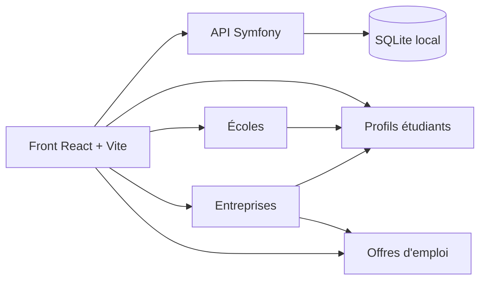

# CV-Theque

Plateforme de mise en relation pour étudiants, écoles et entreprises, avec profils liés, recherche par tags et fiches éditables.



## Ce que fait le projet

- Annuaire des étudiants avec fiches détaillées et filtrage par compétence.
- Pages écoles et entreprises avec recherche, présentation enrichie et listes associées.
- Profil connecté éditable selon le rôle, avec tags partagés réutilisables dans toute l’application.
- Offres d’emploi liées aux entreprises et filtrables par mots-clés.
- Console admin locale pour valider les comptes et gérer les rôles.

## Démarrage rapide

1. Lancer le projet complet:

```bash
./start-dev.sh
```

2. Ouvrir les interfaces:

- Front: http://127.0.0.1:5173 ou le port Vite affiché au démarrage
- API Symfony: http://127.0.0.1:8000

3. Compte admin local par défaut:

- Email: admin@cvtheque.local
- Mot de passe: admin123

## Architecture

- `Back/`: API Symfony, Doctrine, migrations et données relationnelles.
- `Front/`: application React, pages publiques, profils liés et auth locale.
- `start-dev.sh`: démarre Symfony et Vite avec SQLite local forcé.

## Données métier

- Un étudiant appartient à une école.
- Un étudiant peut être lié à une entreprise.
- Une offre appartient obligatoirement à une entreprise.
- Les compétences, spécialités et tags sont réutilisables d’un profil à l’autre.

## Notes

- Le projet local force `DATABASE_URL=sqlite:///var/cvtheque.db` au démarrage.
- Les pages école, entreprise et profil sont pensées pour être consultées et modifiées comme une vitrine de type LinkedIn.